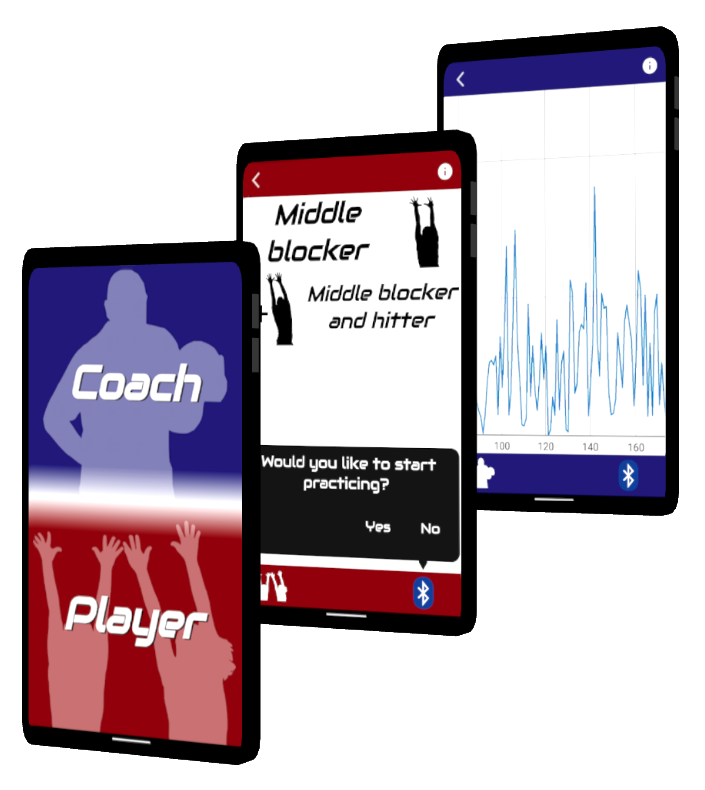

# Body tracker
#### android app prototype

It detects body movements and sends the data obtained from the sensors of the player device, to the coach device via bluetooth.

Technologies / frameworks used:
* Sensor system service
* Bluetooth system service
* Download system service
* Room library
* Media player

